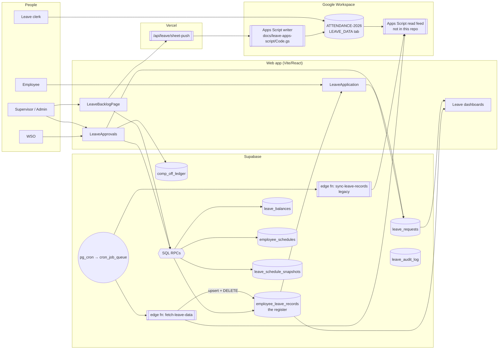

# Leave system — current architecture (as-is)

This is a map of how leave works **today**: where each fact is stored, who
writes it, how approvals and balances move, and how the ATTENDANCE-2026 Google
Sheet is read into the app and written back. It ends with a risk register of
every path found that can lose, duplicate or corrupt leave data.

The redesign that addresses those risks is in
[SHEET_INDEPENDENCE.md](SHEET_INDEPENDENCE.md), and day-to-day procedures are in
[RUNBOOK.md](RUNBOOK.md).

> Surveyed at commit `9722cd5`. File references are `path:line` at that commit.
> This is the system **before** migrations `20261005100000` / `20261005110000`.
> What each risk below looks like now is in
> [SHEET_INDEPENDENCE.md §10](SHEET_INDEPENDENCE.md#10-risk-register-status).

---

## 1. The short version

1. **Three stores hold leave facts, and none of them is complete on its own.**
   - `leave_requests` holds what was applied for and approved in the app.
   - `employee_leave_records` (the *register*) is mostly a copy of the Google Sheet.
   - `employee_schedules` holds the roster, where leave shows up as a duty code.
2. **The Google Sheet is the de facto system of record for balances.** The
   CL/RH balance an employee sees is `12 − CL rows in the register` and
   `2 − RH rows in the register`. Those rows come almost entirely from the sheet.
3. **An approval in the app never writes to the register.** Only the supervisor
   backlog tool (`backfill_leave_entry`) does. So an approved CL counts against
   the balance only after a clerk types it into the sheet and the next sync
   pulls it in.
4. **The sheet sync deletes.** Every run hard-deletes any sheet-sourced row that
   the latest feed did not contain. If the sheet is replaced, closed,
   truncated or switched to next year's workbook, the app's history goes with it.
5. **The sync also overwrites app work.** A comp-off the app marked as used is
   un-marked by the next sync unless the clerk has already typed the same date
   into the sheet.

Together, (3), (4) and (5) mean that closing the sheet today would either wipe
the app's leave history, if the feed goes empty or changes shape, or freeze
every balance at its last synced value.

---

## 2. System context



---

## 3. Data stores

### 3.1 `leave_requests` — applications and approvals

One row per application. Created by the employee (`LeaveApplication.tsx`) or by
a supervisor through backfill/amendment.

| Concern | Detail |
| --- | --- |
| Identity | `employee_id` = `auth.users.id` (UUID), **not** the employee code |
| Status machine | `Pending WSO → Pending Supervisor → Approved`, or `Pending WSO → Approved` (direct), `→ Rejected`, `→ Cancelled` |
| Immutability | `protect_leave_request_immutable_fields()` blocks changes to type, dates, days, RH date etc. once out of pending (`20260404000000_leave_production_hardening.sql:46`) |
| Overlap | `check_leave_overlap()` trigger rejects overlapping active requests (`…hardening.sql:108`) |
| Provenance | `origin` = `employee` \| `backfill` \| `amendment`, plus `supersedes_id` / `superseded_by_id` (`20260816100000_leave_backfill_foundation.sql:77`) |
| Comp-off choice | `comp_off_record_ids` — register row ids chosen to pay for a COMP_OFF request |
| CH handling | `ch_comp_off_dates` — closed holidays inside a CL/COMP_OFF range; not deducted |

### 3.2 `employee_leave_records` — the register

One row per dated event per employee. Almost every row originates in the sheet.

| Column | Meaning |
| --- | --- |
| `emp_id` | Employee code (`profiles.employee_id`) — a different identity from `leave_requests.employee_id` |
| `leave_category` | `CL`, `RH`, `NH`, `CH`, `COMP_OFF_EARNED`, `LAST_YEAR_CH_DUTY`, `OPE`, `COMP_OFF`, plus leave types written by backfill (`EL`, `CL_1ST`, …) |
| `leave_date` | For plain leave, the day off. **For comp-off categories, the duty date** that earned it |
| `leave_used_on` | For comp-off categories, the day the comp-off was taken |
| `source` | `google_sheets` (default!) or `webapp` |
| `sync_batch_id` | The sync run that last wrote the row |
| `metadata` | Free-form; the app stores `leave_request_id` here when it consumes a comp-off or backfills a leave |

Unique key: `(emp_id, leave_category, source_event_type, leave_date, duty_code)`
(`20260314201956_leave_event_columns.sql`). The key does **not** include
`source`, so a sheet row and an app row for the same fact collide on purpose.

RLS: employees read their own rows; approved WSO/supervisor/admin can read
**and insert, update or delete any row** ("Staff manage leave records",
`20260311_employee_leave_records.sql:51`).

### 3.3 Balance stores

| Store | Written by | Read by |
| --- | --- | --- |
| `leave_balances` (per user, type, year) | `deduct_leave_balance()` on approval, `restore_leave_balance()` on cancel, `recompute_leave_balance()` from the backlog page | Employee dashboard, supervisor employee overview, apply form (fallback only) |
| Register-derived | Computed in the browser: `casualRemaining = max(12 − count(CL rows), 0)` (`src/utils/leaveCalculations.ts:315`) | Apply form (**primary**), employee leave page tiles, supervisor dashboards |
| `leave_balances_cache` | Raw sheet payload cache (legacy) | `src/services/leaveApi.ts` |

### 3.4 Other leave tables

| Table | Purpose |
| --- | --- |
| `employee_schedules` | Roster. Approval overwrites days with `duty_code = 'LEAVE'` |
| `leave_schedule_snapshots` | The pre-leave roster value, so a cancellation can restore it |
| `comp_off_ledger` | CH comp-off *credits* from approvals and roster sync. **Not** used by the COMP_OFF allocator, which only reads the register |
| `leave_audit_log` | Append-only trail for backfill, amendment, recompute and conflict resolution |
| `leave_backfill_batches` | Groups a backlog-clearing session |
| `app_settings.leave_data_webapp_url` | The Apps Script read-feed URL (client-readable) |

### 3.5 Identity bridge

```
leave_requests.employee_id (auth uuid) ──profiles.id──► profiles.employee_id (code) ◄── employee_leave_records.emp_id
                                                                                  ◄── employee_schedules.employee_code
                                                                                  ◄── sheet column B "EMP NO"
```

Every cross-store join goes through `profiles`. An employee in the sheet with no
profile row, for example someone who never signed up, has register rows but can
never have a `leave_requests` row.

---

## 4. Who writes what

| Writer | `leave_requests` | Register | `leave_balances` | Roster | Sheet |
| --- | --- | --- | --- | --- | --- |
| Employee apply/cancel-pending | insert / status | — | — | — | — |
| WSO approve | status + WSO fields | — | — | — | — |
| Supervisor final approve | status | comp-off **stamps** on sheet rows (COMP_OFF only) | deduct (CL/RH) | `LEAVE` + snapshot | — |
| Cancel approved | status | comp-off un-stamp | restore (CL/RH) | restore from snapshot | — |
| Backfill (`backfill_leave_entry`) | insert Approved | **inserts** `source='webapp'` rows; comp-off stamps | — (derived later) | `LEAVE` if not already leave | — |
| Amend (`amend_leave_request`) | cancel + insert | clears backfill rows, re-inserts | restore if origin employee | restore + re-apply | — |
| Recompute balance | — | — | overwrite = `12 − approved CL` | — | — |
| `fetch-leave-data` (cron, 4×/day) | — | **upsert all + delete missing** | — | — | read |
| `sync-leave-records` (cron, legacy) | — | upsert (fails today) | — | — | read |
| Send to Google Sheets | — | read | — | — | **write** |
| Leave clerk | — | — | — | — | **write** (by hand) |

---

## 5. Flows

### 5.1 Apply

`src/pages/employee/LeaveApplication.tsx`

1. The employee picks a type and dates. The CL-family and COMP_OFF types
   exclude closed holidays from the day count and record them in `ch_comp_off_dates`.
2. Balance check (`LeaveApplication.tsx:372-436`):
   - **CL:** `casualRemaining` from the register, if the employee has any
     register rows. Otherwise `leave_balances`. Otherwise `12 − approved requests`.
   - **RH:** `2 − RH rows in register`, with the same fallbacks.
   - **COMP_OFF:** available earned register rows minus days reserved by pending COMP_OFF requests.
   - Then minus days in **pending** requests of the same bucket.
   - EL / NEE / HPL / COMM are not balance-checked.
3. Insert into `leave_requests` with status `Pending WSO`.

**Gap:** approved requests are assumed to be in the balance already. They are
not in the register until the sheet catches up, so they are never subtracted.
An employee with 10 CLs in the sheet and 2 approved in the app is shown 2
remaining, not 0.

### 5.2 Approve

`src/hooks/useLeaveRequests.ts:580-699` (`useReviewLeaveRequest`)

```mermaid
sequenceDiagram
  participant S as Supervisor browser
  participant DB as Supabase
  S->>DB: UPDATE leave_requests SET status='Approved' WHERE status=expected
  Note over DB: committed — the rest are separate calls
  S->>DB: rpc allocate_comp_off_for_leave (COMP_OFF only)
  S->>DB: upsert comp_off_ledger (CH dates)
  S->>DB: rpc apply_leave_to_schedule (snapshot + LEAVE)
  S->>DB: rpc deduct_leave_balance (CL/RH; errors swallowed)
  S-->>DB: invoke send-notification (fire and forget)
```

Four separate round-trips after the status change has already committed. A
failure part-way leaves an Approved request with only some of its side effects.
The balance deduction failure is logged to Sentry and ignored
(`useLeaveRequests.ts:321-332`).

`src/services/leave-request.service.ts` and `src/hooks/leave/*` implement the
same flow a second time. No page imports them.

### 5.3 Cancel

- **Pending, by the employee:** status → `Cancelled`. No side effects.
- **Approved, by staff** (`useLeaveRequests.ts:505-577`): status → `Cancelled`,
  then un-stamp comp-off, restore the roster from snapshots, and
  `restore_leave_balance`.
  - For a **backfilled** request this path neither removes the register rows
    backfill wrote (so the CL still counts) nor skips the balance restore
    (backfill never deducted, so `leave_balances` goes *up*).
    `amend_leave_request` handles both correctly; the Cancel button does not.

### 5.4 Balances: three definitions

| Definition | Formula | Includes sheet-only history | Includes app approvals not yet in sheet |
| --- | --- | --- | --- |
| Register-derived (what employees see) | `12 − count(register CL rows)` | ✅ | ❌ |
| `leave_balances` counter | 12, then −approved, +cancelled | ❌ | ✅ |
| `recompute_leave_balance()` | `12 − Σ approved leave_requests CL days` | ❌ | ✅ |

Half days are handled inconsistently:

- The register view counts only `leave_category = 'CL'` (`src/hooks/useLeaveData.ts:230`).
- `CL_1ST` / `CL_2ND` rows are ignored.
- `fetch-leave-data` does not read the sheet's four `1/2 CL` columns at all.

### 5.5 Comp-off

- **Earned:** register rows `COMP_OFF_EARNED` (CH duty), `LAST_YEAR_CH_DUTY` and
  `OPE`, all from the sheet. `leave_date` is the duty date; expiry is duty date
  + 3 months − 1 day.
- **Used:** `leave_used_on` set on the earned row.
  - The sheet sets it when the clerk fills in the C-OFF column.
  - The app sets it through `allocate_comp_off_for_leave`, which also writes
    `metadata.leave_request_id` (`…hardening.sql:186-210`).
- **Reserved:** pending COMP_OFF requests are subtracted in the browser.

The app's stamp goes onto a row the sheet owns (`source='google_sheets'`). See
risk R2.

### 5.6 Backlog clearing

`src/pages/supervisor/LeaveBacklogPage.tsx`, `src/hooks/useLeaveBacklog.ts`,
`src/lib/leaveReconciliation.ts`, `supabase/migrations/20260816110000_leave_backfill_rpcs.sql`

1. **Detect.** `fetchLeaveDiscrepancies()` finds roster days with a leave duty
   code that have neither a request nor a register row (`schedule_no_request`).
   Consecutive days are grouped into one item.
2. **Clear.** `backfill_leave_entry()` does all of the following in one
   transaction:
   - inserts an Approved `leave_requests` row (`origin='backfill'`);
   - inserts register rows with `source='webapp'` on the **same key the sheet would use**;
   - stamps chosen comp-off rows;
   - snapshots and marks the roster, skipping days already marked leave;
   - credits closed holidays;
   - writes `leave_audit_log`.

   It does **not** deduct a balance.
3. **Correct.** `amend_leave_request()` cancels the original, reverses its side
   effects and re-runs backfill with the corrected values.
4. **Balance.** `recompute_leave_balance()` rewrites `leave_balances` as
   `12 − approved CL` for the year.
5. **Conflicts.** When the sheet later sends a row on an app-owned key,
   `protect_app_authored_leave_records()` keeps the app row and parks the sheet's
   version in `metadata.sheet_shadow`. The supervisor resolves it with
   `resolve_leave_sheet_conflict()`.
6. **Push.** "Send to Google Sheets" writes the register into the sheet (§5.8).

### 5.7 Sheet → app sync

`supabase/functions/fetch-leave-data/index.ts`

**Schedule:** the queued jobs `leave-sync-10h`, `-14h` and `-18h` (IST) plus
`leave-sync-daily` (23:20 IST). The legacy `sync-leave-records` is also
registered every 2 hours as a direct HTTP job.

1. GET the Apps Script read feed (`app_settings.leave_data_webapp_url`). No auth.
2. Accept either `{data:[…]}` / `[…]` of per-employee objects (legacy sections)
   or the `{employee, events}` shape.
3. Flatten each employee into register rows:

   | Sheet section | Category | `leave_date` | `leave_used_on` |
   | --- | --- | --- | --- |
   | `casualLeave[]` | `CL` | the date | — |
   | `restrictedHolidays[]` | `RH` | RH holiday date | — (`metadata.leave_applied` = day taken) |
   | `nationalHolidays[]` | `NH` | the date | — |
   | `closedHolidays[]` | `CH` | the **comp-off** date (no holiday date kept) | — |
   | `lastYearCompOff[]` | `COMP_OFF` / `OPE` | duty date | day taken |
   | `opeDuty[]` | `OPE` | OPE duty date | — (kept in `raw_leave_used_value`) |
   | events `COMP_OFF_DUTY` | `COMP_OFF_EARNED` | CH duty date | day taken |

4. Deduplicate twice: by a canonical comp-off key, then by the table's unique key.
5. **Upsert** in batches of 500 on the unique key, writing *every* column,
   `metadata` included (`index.ts:712-731`).
6. **Delete** every `source='google_sheets'` row whose `sync_batch_id` is not
   this run's (`index.ts:733-744`).
7. Log to `api_call_logs` and `sync_jobs`.

The half-day CL columns are never read, and the `closedHolidays` CH rows lose
the holiday date.

### 5.8 App → sheet push

`src/hooks/useLeaveBacklog.ts:426` → `api/leave/[...route].ts` →
`lib/leave/sheetPush.ts` → `lib/leaveSheetPayload.ts` → Apps Script
`docs/leave-apps-script/Code.gs` → LEAVE_DATA tab.
Detail in [../LEAVE_SHEET_WRITEBACK.md](../LEAVE_SHEET_WRITEBACK.md).

1. The server checks the caller is an approved supervisor or admin, then reads
   the **whole** register.
2. `buildSheetPayload()` groups rows per employee into sheet sections:
   - `CL` → `casualLeave`
   - `RH` → `restrictedHolidays`
   - `NH` → `nationalHolidays`
   - `COMP_OFF_EARNED` / `COMP_OFF` → `closedHolidays`
   - `LAST_YEAR_CH_DUTY` → `lastYearCompOff`
   - `OPE` → `opeDuty`

   Everything else (`CL_1ST`, `CL_2ND`, `EL`, `CH`, …) is reported as skipped.
3. The payload goes to Apps Script, which:
   1. resolves the column layout from the header rows;
   2. matches employees by EMP NO and confirms the name;
   3. writes only inside the writable block, never over a formula;
   4. in `merge` mode, appends list values and sets slot values;
   5. returns a per-cell diff.
4. The UI shows the dry-run diff, then sends the same request with `dryRun:false`.

### 5.9 Scheduled jobs touching leave

| Job | Schedule (UTC) | Target | Mechanism |
| --- | --- | --- | --- |
| `leave-sync-10h` | 04:35 | `fetch-leave-data` | queue |
| `leave-sync-14h` | 08:35 | `fetch-leave-data` | queue |
| `leave-sync-18h` | 12:35 | `fetch-leave-data` | queue |
| `leave-sync-daily` | 17:50 | `fetch-leave-data` | queue |
| `sync-leave-records` | every 2h | `sync-leave-records` | direct `net.http_post` (`20260323300000_fix_cron_job_timeouts.sql:22`) |

---

## 6. Risk register

Severity reflects impact on leave data, not how often the problem occurs.

| # | Sev | Risk | Where | What actually happens |
| --- | --- | --- | --- | --- |
| R1 | **Critical** | Sync hard-deletes anything missing from the latest feed | `supabase/functions/fetch-leave-data/index.ts:733-744` | Rows deleted from the sheet, a filtered or partial feed, an employee transferred off the tab, or pointing the URL at ATTENDANCE-2027 all delete app history permanently. There is no archive and no threshold. |
| R2 | **Critical** | Sync overwrites the app's comp-off usage | `fetch-leave-data/index.ts:718-722`; stamp at `…hardening.sql:186-210`; guard only for `webapp` rows at `20260816100000_leave_backfill_foundation.sql:251` | An approved COMP_OFF stamps a sheet-owned row. The next sync rewrites `leave_used_on` (to null if the clerk has not typed it yet) and replaces `metadata`, dropping `leave_request_id`. The comp-off becomes available again, so it can be spent twice, and cancelling the leave can no longer find it. |
| R3 | **High** | App approvals never reach the register | only `backfill_leave_entry` inserts register rows (`20260816110000_leave_backfill_rpcs.sql:268`); approval flow at `src/hooks/useLeaveRequests.ts:656-661` | Balances ignore approved-but-not-yet-typed leave (over-application). Send to Google Sheets cannot push app-approved CL/RH. **When the sheet closes, balances stop moving.** |
| R4 | High | Three disagreeing balance definitions; half days dropped | §5.4; `src/utils/leaveCalculations.ts:315`; `src/hooks/useLeaveData.ts:230`; `20260816110000…:631-647` | Different screens show different CL balances. `recompute_leave_balance` ignores sheet-only history. Half-day CLs are not counted anywhere in the register. |
| R5 | High | Write-back "merge" can blank sheet cells | `lib/leaveSheetPayload.ts:146,161,167,173` send `leaveApplied: ""`; `docs/leave-apps-script/Code.gs:1093-1099` turns `""` into a write; applied at `Code.gs:723,809,900` | A comp-off date the clerk entered, which the app has not synced yet, is erased by a push. |
| R6 | Medium | Write-back overwrites a different non-blank value silently | `Code.gs:808-809` | The sheet's `L`/`CH`/date is replaced by the app's value with no conflict raised. |
| R7 | Medium | Lost update against concurrent human edits | `Code.gs:495-498` read, `Code.gs:577-606` whole-row block write | A clerk's edit made between the read and the write, on the same rows, is reverted. `LockService` only serialises script writers. |
| R8 | Medium | Preview ≠ commit, and no durable record of pushes | `lib/leave/sheetPush.ts:84-99` rebuilds the payload on commit | If the register changed after the preview, different cells are written from those reviewed. There is no server-side log of what was written. |
| R9 | Medium | Backfilled RH and half-day leave don't map to the sheet | backfill writes RH with `leave_date` = day taken (`20260816110000…:264-281`); sheet RH rows key on the RH holiday date (`fetch-leave-data/index.ts:559-576`); payload builder drops `CL_1ST`/`CL_2ND` | When the sheet catches up, RH is counted twice. The push writes the day taken into the R/H date column. Half days never reach the sheet. |
| R10 | Medium | Cancelling an approved backfilled leave | `src/hooks/useLeaveRequests.ts:542-544` | Register rows remain, so the CL is still counted. `restore_leave_balance` adds days back that were never deducted. |
| R11 | Medium | Approval side effects are not atomic | `src/hooks/useLeaveRequests.ts:647-661` | A request can be Approved without a roster update, comp-off allocation or balance deduction. |
| R12 | **High (security)** | Leave RPCs are callable by any signed-in user | `deduct_leave_balance` / `restore_leave_balance` granted to `authenticated` (`20260508_leave_balance_deduction.sql:119-120`); `allocate_comp_off_for_leave`, `clear_comp_off_for_leave`, `apply_leave_to_schedule`, `restore_schedule_after_cancellation` are `SECURITY DEFINER` with no role check, no `search_path` and default `PUBLIC` execute (`…hardening.sql:144-396`) | Any employee can raise their own CL balance, clear any comp-off allocation, or overwrite any roster day with `LEAVE`. |
| R13 | Low | Legacy `sync-leave-records` still scheduled | `20260323300000_fix_cron_job_timeouts.sql:22`; contract at `supabase/functions/sync-leave-records/index.ts:41-57` | Expects flat rows the feed does not send. It fails every 2 hours, adding noise to the cron health view. If the feed ever matched, it would upsert with no protections. |
| R14 | Low | Default `source='google_sheets'`, and staff can delete any register row | `20260311_employee_leave_records.sql:13,51` | A manual insert becomes sheet-owned and is purged by the next sync. A direct delete leaves no trail. |
| R15 | Low | Calendar double-counts backfilled leave | `src/pages/supervisor/SupervisorLeaveDashboard.tsx:576,590,613` | The dedup key mixes employee codes (register) with auth UUIDs (requests). |
| R16 | Low | Sheet-shadow conflicts compare formatting, not facts | `20260816100000…:256-275` | Once the sheet catches up with an app row, differences in `status` or `raw_date_value` formatting raise a conflict for rows that actually agree. |
| R17 | Info | Sync upserts are not one transaction | `fetch-leave-data/index.ts:715-731` | A mid-run failure leaves a mix of old and new values. No purge runs in that case. |
| R18 | Info | Duplicate, unused leave service layer | `src/services/leave-request.service.ts`, `src/hooks/leave/*` | Two copies of the approval saga can drift apart. |

### What "the sheet closes" does today

| Event | Result |
| --- | --- |
| The read feed URL stops working (script deleted, access revoked) | The sync errors and nothing changes. Balances freeze: app approvals never reach the register (R3). |
| The feed returns a blank or reset tab | If *any* row comes back, everything else is deleted (R1). |
| Admin points the URL at ATTENDANCE-2027 | Every 2026 register row, including comp-offs earned in late 2026 and still valid in 2027, is deleted (R1). |
| The clerk stops updating the sheet but the feed keeps working | Every sync reverts comp-offs the app used (R2). Balances ignore app approvals (R3). |
