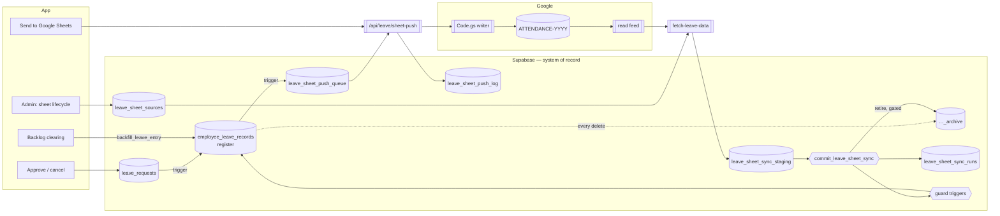
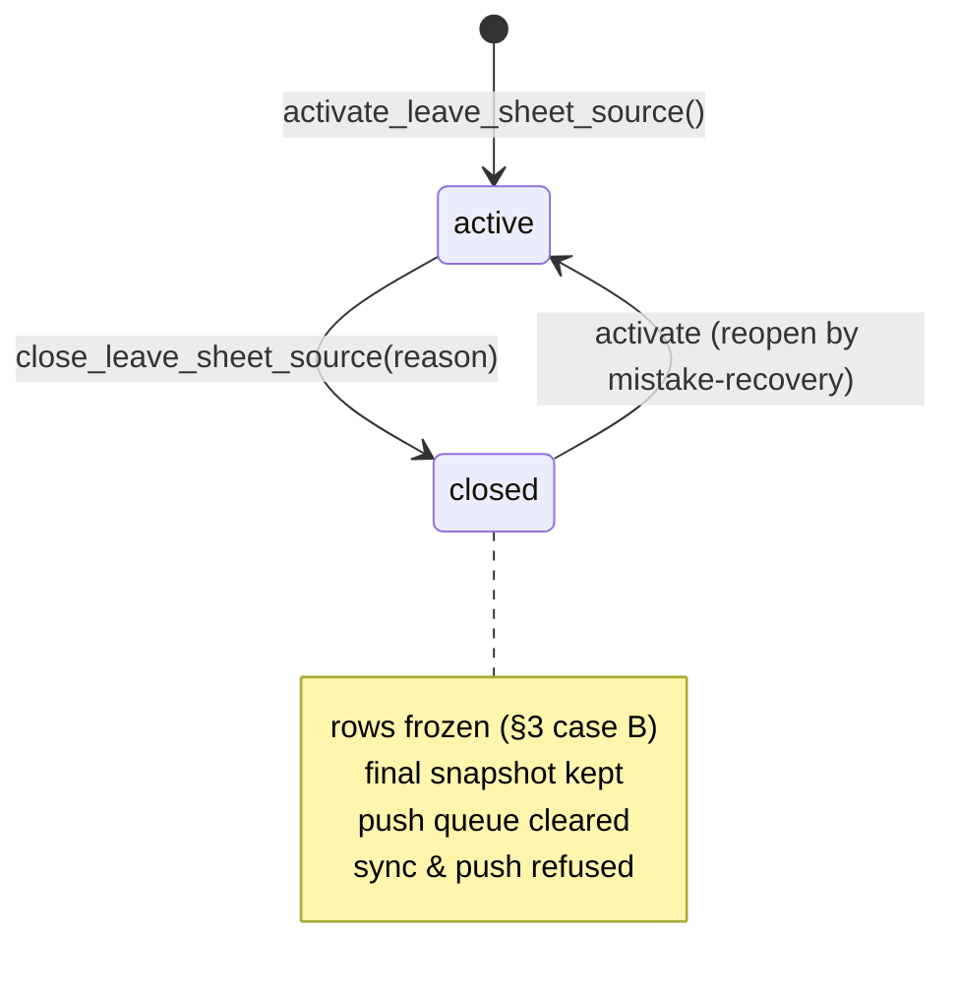

# Leave register: sheet-independent architecture

How leave data is owned, synced and written back once migrations
`20261005100000_leave_sheet_sources_and_safe_sync.sql` and
`20261005110000_leave_register_on_approval.sql` are applied.

It answers three questions:

1. How does the app update the Google Sheet during backlog clearing, without
   breaking or deleting anything there?
2. How is sheet data synced into the app, without breaking or deleting anything
   here?
3. What happens when the sheet is eventually closed?

The system this replaces, and every risk it had, is mapped in
[ARCHITECTURE.md](ARCHITECTURE.md). Step-by-step procedures are in
[RUNBOOK.md](RUNBOOK.md).

---

## 1. Principles

| # | Principle | What enforces it |
| --- | --- | --- |
| P1 | **The database is the system of record.** A workbook is a *source* that feeds it for a while. | `leave_sheet_sources`, `employee_leave_records.sheet_source` |
| P2 | **Every approval is recorded in the app.** The register does not wait for a clerk. | trigger `sync_leave_register_on_status_change` |
| P3 | **Nothing is deleted without a copy, and never by a sync on its own.** Rows the sheet drops are archived, behind circuit breakers. | `employee_leave_records_archive`, trigger `archive_deleted_leave_record`, `commit_leave_sheet_sync()` |
| P4 | **App facts win; sheet facts fill.** A sync cannot undo an allocation or an approval. A disagreement becomes a conflict for a person to settle. | trigger `protect_app_authored_leave_records` (rewritten) |
| P5 | **Writing to the sheet is additive.** A push fills empty cells and reports everything else. | `docs/leave-apps-script/Code.gs` merge rules, `lib/leave/sheetPush.ts` |
| P6 | **Everything is recorded and reversible.** | `leave_sheet_sync_runs`, `leave_sheet_push_log`, `APP_WRITE_LOG` tab, `leave_audit_log`, archive restore |

---

## 2. The shape of it

---

## 3. Ownership: who may change what

A register row is either **app-owned** (`source = 'webapp'`) or **sheet-owned**
(`source = 'google_sheets'`, with `sheet_source` naming the workbook). On top of
either, the app may attach its own facts in `metadata`:

- `leave_request_id`: an approval or allocation;
- `register_link_request_id`: an approval linked to a row the sheet already had;
- `sheet_shadow`: a conflict;
- `sheet_confirmed_at`: the sheet agrees.

When a sync writes to an existing row, the guard trigger applies one of four
rules:

| Case | Existing row | What the sync may do | On disagreement |
| --- | --- | --- | --- |
| **A** | App-owned | Update informational columns (name, status, raw text). Fill a blank used-date. Never change `source`, the used-date or the event kind. | `metadata.sheet_shadow` |
| **B** | From a **closed** workbook | Fill a blank used-date, for example a carried-over comp-off taken in the new year. Nothing else. The row stays attributed to the closed workbook. | `sheet_shadow` |
| **C** | Sheet-owned, but the app allocated it (`leave_request_id`) | Update everything except the used-date and the allocation keys. | `sheet_shadow` if the sheet has a *different* date. A blank means the clerk has not caught up. |
| **D** | Plain sheet row | The sheet's version is taken, keeping any app-only metadata keys. | — |

Conflicts are raised on **facts only** (the used-date and event kind), never on
formatting. When the sheet matches the app, `sheet_confirmed_at` is recorded.
Conflicts are settled on the Leave Discrepancy page through
`resolve_leave_sheet_conflict()`, unchanged.

The guard runs on **any** writer that looks like a sync, not only the new one:
a new `sync_batch_id`, or an attempt to take over an app row. The old edge
function, a hand-written upsert or a future script all get the same rules
(tested in scenario S10).

---

## 4. Sheet → app: the staged, atomic sync

`supabase/functions/fetch-leave-data` → `commit_leave_sheet_sync(run_id)`

1. **Resolve the live source** (`leave_sheet_sources.status = 'active'`).
   - If there is none, the run is a logged no-op: the sheet has been closed.
   - The read URL is the source's own `read_url`, else `app_settings.leave_data_webapp_url`.
2. **Fetch and parse.** The parser is unchanged, so row keys are unchanged.
3. **Stage** the parsed rows into `leave_sheet_sync_staging` under a new
   `leave_sheet_sync_runs` row. The register is not touched yet.
4. **Commit**, in one transaction under an advisory lock:

   | Step | What happens |
   | --- | --- |
   | Refuse | Closed source → `rejected`. Empty feed → `failed`. A feed whose CL/RH/NH dates are mostly another year → `rejected` with "register the new workbook as its own source". **Nothing is written.** |
   | Re-key | App-owned plain-leave rows move onto the key the sheet uses for the same employee, category and day. The legacy feed files a CL as `CL`, the events feed as `CASUAL_LEAVE`, and without this the same leave would count twice. |
   | Upsert | New facts inserted. Changed rows updated through the guard trigger (§3). Unchanged rows not touched at all. |
   | Retire | Rows of **this** source that the feed no longer carries. Rows linked to an app request are never retired; they are flagged `sheet_missing_since` instead. |
   | Circuit breakers | Retirement is applied only if it is at most `GREATEST(retire_max_rows, retire_max_pct % of the source's rows)` (default 50 / 2 %), **and** the feed has at least `min_employee_ratio` (default 90 %) of the employees in the last good run. Otherwise the run commits its upserts but **holds** the retirement (`retire_status = 'blocked'`) until an admin approves it. |
   | Archive | Retired rows are copied to `employee_leave_records_archive` by the delete trigger, with the run id. |
   | Record | Counts, reason and feed year land on the run. Staging is kept for the last 12 runs per source, and forever for a closed source's final run. |

The edge function logs rejections as errors, so cron health shows them. A held
retirement is logged with "ATTENTION" and shown in the admin panel.

**What cannot happen any more:** a partial feed, a blank tab, a re-pointed URL
or an employee leaving the tab deleting history (R1). A sync reverting a
comp-off the app allocated (R2). The legacy `sync-leave-records` touching the
register (R13): it is unscheduled and answers 410.

---

## 5. App → register: approvals write the register

`write_register_rows_for_request()` runs inside the approving
`UPDATE leave_requests SET status = 'Approved'`, so a request cannot be
Approved without its register rows.

| Leave type | Register rows |
| --- | --- |
| CL, CL_CON | One `CL` row per day, closed holidays in the range excluded |
| CL_1ST / CL_2ND (+ _CON) | One `CL_1ST` / `CL_2ND` row; counts ½ |
| RH | One `RH` row keyed by **the holiday it was declared against** (`actual_rh_date`), with the day taken in `metadata.leave_applied`. This is the sheet's own convention. A request without an RH date is skipped with a warning rather than keyed wrongly. |
| EL, NEE, HPL, COMM, … | One row per day (no sheet column; still counted in the register) |
| COMP_OFF | No new row: the earned rows it consumes are stamped, as before |

If the register already has the fact (same employee, category and day, whatever
key or source), the approval **links** to it (`register_link_request_id`)
instead of adding a row. The sheet keeps owning what it recorded first.

Leaving Approved (a cancellation) removes the rows the request created, into the
archive, and unlinks rows the sheet owns. This covers backfilled requests
cancelled through the normal Cancel button (R10). That path also no longer
restores a balance that backfill never deducted.

On deploy, every existing approved employee request is written once in the same
way. Employees whose approved leave the clerk had not yet typed in will see
their balance drop to the correct figure.

**Balance.** There is now one definition. CL used is the count of full-day CL
register rows plus ½ per half-day row in the year; RH used is the count of RH
rows. The apply form, the leave page tiles and `recompute_leave_balance()` all
use it (R4).

---

## 6. App → sheet: additive write-back

**Leave Backlog → Send to Google Sheets** → `/api/leave/sheet-push` →
`buildSheetPayload()` → Apps Script `Code.gs`.

### What is sent

- **Pending only (default).** Every app-side change to a sheet-representable row
  queues its employee in `leave_sheet_push_queue`: an approval, a backfill, a
  comp-off allocation or a cancellation. The dialog can also check every
  employee.
- **Facts only.** The payload omits anything the app does not know. It never
  sends `""`.
- **Correct placement.** Half-day CLs go to the `1/2 CL` columns. An RH is keyed
  by its holiday. Last year's open closed-holiday comp-offs go to the last-year
  block. Entries whose holiday date was lost in parsing are skipped and
  reported, never guessed.

### What the writer will and will not do (merge, the only mode from the app)

| Situation on the sheet | Result |
| --- | --- |
| Empty cell | Filled |
| `NA`, a holiday that has not happened yet | Filled |
| Same value, including legacy `29 Apr` against `2026-04-29` | No change |
| Different value | **Not written.** Listed under `conflicts` (cell, sheet value, app value). |
| Payload has no value | **Not cleared** |
| Formula | Never written |
| Row edited by someone after the writer read it | **Row skipped** (`concurrentEdits`); stays queued |
| Workbook named for another year than the live source | **Refused before anything is read or written** |
| Leave cancelled in the app | Never deleted from the sheet. Listed under *manual removals* for the clerk. |

`replace` mode, which can blank a section, is refused by the app endpoint. It
stays available to `scripts/leave-sheet-push.ts` for a deliberate, supervised
rebuild.

### Preview is what gets written

The dry run returns a SHA-256 fingerprint of the payload. The write must send it
back. If the register changed in between, the write is refused with "preview
again" (R8).

### Records

- `leave_sheet_push_log`: every write, with actor, fingerprint, counts and the
  full per-cell diff returned by the script.
- `APP_WRITE_LOG` tab in the workbook: one line per written cell (time, request
  id, actor, cell, before, after). Any write can be traced and undone by hand.
- The queue entry for an employee is cleared only when their row was written
  with no conflicts and no concurrent edit. An employee changed again during the
  push stays queued.

---

## 7. Sheet lifecycle and year end

Only one workbook can be live. Closing needs an admin, a reason and the key
typed back. It freezes every row the workbook contributed: no later sync can
change or remove them, apart from filling a blank used-date for a carried-over
comp-off.

Opening next year's workbook is a separate, explicit act. Its sync retires only
its own rows, so last year's history is untouched whatever the new tab contains
(scenario S14). Pointing the old source's URL at a new-year workbook is caught
by the year check and rejected.

If no successor is ever registered, nothing syncs and nothing is pushed, and
the app carries on. Approvals keep writing the register, balances stay correct,
and the Admin panel says so.

---

## 8. What "the sheet closes" does now

| Event | Before | Now |
| --- | --- | --- |
| Read feed URL dies | Sync errors, balances freeze | Sync errors, **balances keep moving**: approvals write the register |
| Feed returns a blank or reset tab | Everything else deleted | Empty → rejected. Partial → upserts only; retirement held for an admin. |
| URL re-pointed at next year's workbook | All history deleted | Rejected: "register the new workbook as its own source" |
| Clerk stops updating the sheet | Comp-offs reverted every sync; balances ignore approvals | App facts kept; the sheet's blanks are "behind", not conflicts |
| Admin closes the sheet | — (no concept) | Frozen, final snapshot kept, sync and push stop cleanly |

---

## 9. Security fixes in the same change

These were found while mapping the flows.

- `deduct_leave_balance`, `restore_leave_balance`, `allocate_comp_off_for_leave`,
  `clear_comp_off_for_leave`, `apply_leave_to_schedule` and
  `restore_schedule_after_cancellation` now require an approved WSO, supervisor
  or admin (or a backend session). They have a pinned `search_path` and no
  `anon` execute. Before, any signed-in employee could raise their own balance
  or rewrite anyone's roster (R12).
- Sheet lifecycle, retirement approval and archive restore are admin-only.
  `commit_leave_sheet_sync` is service-role only.
- Supabase grants `anon` and `authenticated` EXECUTE on every new function by
  default, so each REVOKE names those roles as well as `PUBLIC`. The internal
  register helpers (`write_register_rows_for_request`, `upsert_app_register_row`,
  `unlink_register_rows_for_request`) are reachable only through the approval
  trigger, never directly.
- Sheet-owned register rows can no longer be deleted directly, including through
  the "Staff manage leave records" policy. App rows can be, but are archived
  first (R14).

---

## 10. Risk register status

| # | Risk | Status |
| --- | --- | --- |
| R1 | Sync hard-deletes | **Fixed.** Scoped, gated retirement into an archive; direct deletes refused. |
| R2 | Sync overwrites comp-off usage | **Fixed.** Guard case C, for every sync writer. |
| R3 | Approvals never reach the register | **Fixed.** Approval trigger plus one-time backfill. |
| R4 | Three balance definitions; half days dropped | **Fixed.** Register-based everywhere; half days counted ½. |
| R5 | Push blanks cells | **Fixed.** Payload omits blanks; writer refuses them. |
| R6 | Push overwrites different values | **Fixed.** Reported as conflicts. |
| R7 | Lost update against concurrent edits | **Fixed.** Per-row re-read before write. |
| R8 | Preview ≠ commit; no push record | **Fixed.** Fingerprint, push log, `APP_WRITE_LOG` tab. |
| R9 | RH and half-day mapping | **Fixed** for app and backfill rows; see §11 for sheet-side half days. |
| R10 | Cancelling a backfilled leave | **Fixed.** |
| R11 | Approval side effects not atomic | **Partly.** Register rows are now atomic with the status change. Comp-off allocation, roster and `leave_balances` still run as separate client calls (§11). |
| R12 | RPCs open to any user | **Fixed.** |
| R13 | Legacy sync job | **Fixed.** Unscheduled; function returns 410. |
| R14 | Default source, staff deletes | **Mitigated.** Deletes guarded and archived; the default is unchanged. |
| R15 | Calendar double count | **Fixed.** Request-linked register rows are skipped. |
| R16 | Spurious conflicts | **Fixed.** Facts only. |
| R17 | Non-atomic sync | **Fixed.** Staged, single-transaction commit. |
| R18 | Duplicate service layer | Open, unused code (§11) |

---

## 11. Known gaps and next steps

1. **One approval RPC.** Move comp-off allocation, the roster write and the
   `leave_balances` deduction into a single `approve_leave_request()`
   transaction. That closes R11 fully and lets the client saga and
   `src/services/leave-request.service.ts` go.
2. **Confirm the live read-feed shape.** The read-feed Apps Script is not in
   this repo.
   - The data suggests the `events` shape. Its parser branch never emits RH or
     NH rows, so those would come only from app approvals.
   - Re-keying (§4) makes CL safe under either shape.
   - Check with `SELECT source_event_type, leave_category, count(*) FROM employee_leave_records WHERE source = 'google_sheets' GROUP BY 1, 2;`
3. **Sheet half days.** The feed never reads the `1/2 CL` columns, so half days
   typed only into the sheet are invisible to the app. Adding them to the read
   feed as `halfCasualLeave` needs a category decision, because the sheet does
   not say which half.
4. **`comp_off_ledger`** holds CH credits the COMP_OFF allocator never reads.
   Fold it into the register or drop it.
5. **Automatic push.** The queue makes an unattended worker straightforward. It
   is deliberately not enabled: writes to a clerk-maintained workbook stay
   preview-then-commit.
6. **UI check.** The Backlog dialog changes and the Admin lifecycle panel are
   type-checked and built but have not been exercised against a live backend.

---

## 12. Tests

| Suite | Covers |
| --- | --- |
| `scripts/db-tests/leave-ledger/run.sh` | Real migrations on a throwaway PostgreSQL with Supabase's default privileges reproduced. 15 scenario groups: after-migration state, unchanged feed, catch-up (both feed shapes), conflicts, retirement, protected rows, approval/cancel run as `authenticated`, backfill cancel, role guards, function privileges for `anon` / `authenticated`, delete guard, legacy upsert, balance, truncated feed + approval, empty/wrong-year feeds, year end. Mutation-checked: disabling either guard trigger fails it. |
| `src/lib/__tests__/leaveSheetWriteback.test.ts` | `Code.gs` in a VM against a fixture tab, including never-blank, conflicts, NA fill, spare slots, concurrent edit, write log, wrong-year refusal. The new cases fail against the old script. |
| `src/lib/__tests__/leaveSheetPayload.test.ts` | Payload mapping: blanks omitted, half days, RH keying, last-year routing, unplaceable entries |
| `src/utils/__tests__/leaveCalculations.test.ts` | ½-day CL counting |
